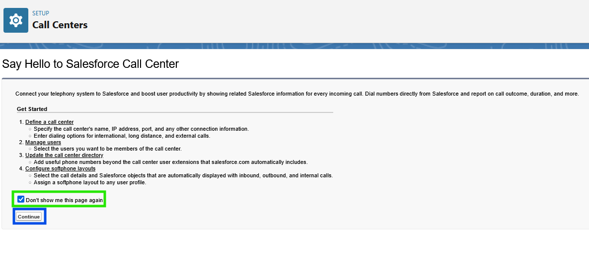
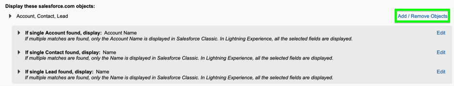
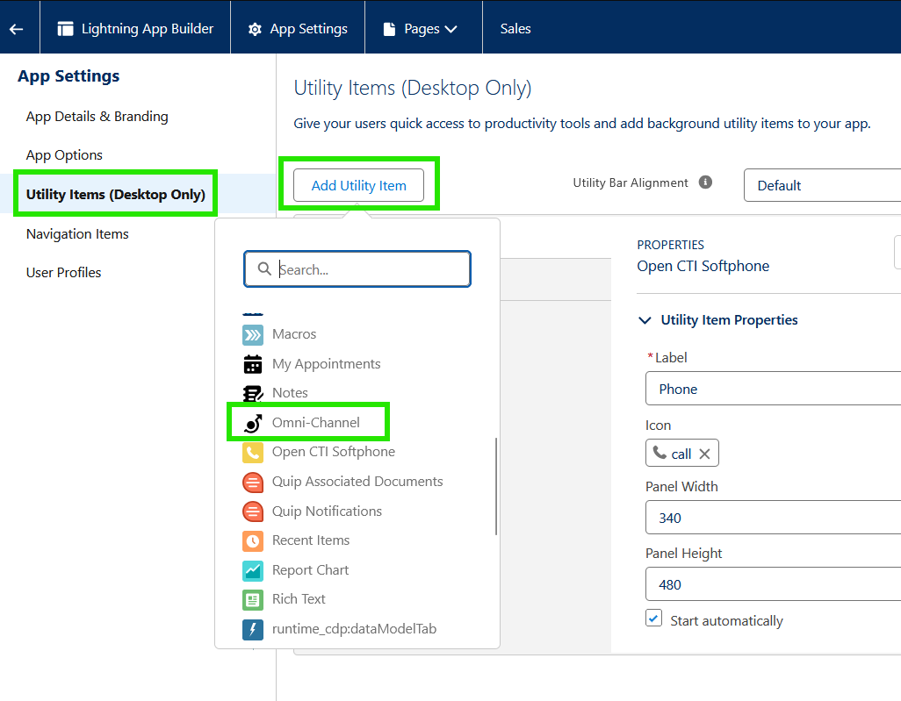

# Task 1 - Integrate Webex Contact Center with Salesforce Using the New CRM Connector

Please use the following credentials to complete the tasks:

| <!-- -->                  | <!-- -->         |
| ------------------------- | ---------------- |
| `Control Hub`             | <a href="https://admin.webex.com" target="_blank">https://admin.webex.com</a> |
| `Salesforce`   | <a href="https://login.salesforce.com" target="_blank">https://login.salesforce.com/</a> |
| `WxCC Username`       | labuser**ID**@wx1.wbx.ai  |     
|                       | _(where **ID** is your selected pod number (01 through 30); i.e. labuser**02**@wx1.wbx.ai if selected pod is 2)_       |
| `WxCC Password`       | webexONE1!         |
| `Salesforce Username`       | labuser**ID**@wx1.wbx.ai  |
|                       | _(where **ID** is your selected pod number (01 through 30); i.e. labuser**02**@wx1.wbx.ai if selected pod is 2)_       |
| `Salesforce Password`       | webexONE1!       |

!!! info "Task Objectives"
	- Define and configure the Call Center in Salesforce and add users.
	- Create a softphone layout and set screen pop preferences.
	- Add the Webex Contact Center softphone to the Salesforce Sales app.
	- Test the Webex Contact Center softphone integration in Salesforce.
 
## **Section 1 - Configure Call Center**

!!! warning "Attention"
	Please use the **Firefox** browser to access, configure, and test within the Salesforce portal.

- Navigate to Salesforce portal and log in with the credentials provided.

!!! note
	The package for the WxCC V2 Salesforce connector is already pre-installed. In production environments, it will need to be installed manually and can be retrieved from <a href="https://login.salesforce.com/packaging/installPackage.apexp?p0=04tUl000000VK45IAG" target="_blank">this link</a>.

- Visit the Github repository to download the latest call center definition file - <a href="https://github.com/webex/webex-contact-center-crm-connectors/blob/main/salesforce/OpenCTI.callCenter-meta.xml" target="_blank">https://github.com/webex/webex-contact-center-crm-connectors/blob/main/salesforce/OpenCTI.callCenter-meta.xml</a> (click **'Download raw file button'**).

{ width="600" }

- In Salesforce, navigate to **'Setup'** by clicking the gear icon in the top-right corner and selecting **'Setup'**.

{ width="350" }

- In the Salesforce portal, navigate to **'Feature Settings > Service > Call Center > Call Centers'** (or type _Call Centers_ in the search bar above the left-hand menu).

- Select **Don't show me this page again** and hit **Continue**.

{ width="350" }

- Click **'Import'**, select **'Browse'** and choose the call center definition file (downloaded earlier).
- Click **'Import'** again to save the added file.

{ width="800" }
{ width="700" }

- After the call center definition file is imported, edit it by clicking **'Edit'**.
- Change **'WxCC Region'** to **'us1'**.

!!! note
	The region defined here should match your Webex Contact Center region (i.e. ca1, anz1, eu1 etc.).

{ width="600" }

- Click **'Save'**.
- Add users to the Call Center:
	- Click **'Manage Call Center Users'** at the bottom of the page and then **'Add More Users'**.
	- Click **'Find'**, select the lab user in use (_labuser**ID**@wx1.wbx.ai_), and click **'Add to Call Center'**.

{ width="500" }
{ width="800" }

## **Section 2 - Configure Softphone Layout**

- Navigate to **'Feature Settings > Service > Call Center > Softphone Layouts'** (or type _Softphone Layouts_ in the search bar above the left-hand menu).
- Click **'New'**.

{ width="800" }

- Provide a name for the **'Softphone Layout'** (e.g., _WxCC layout_).
- Select the **'Is Default Layout'** checkbox.
- Under **'Display these salesforce.com objects'**, click on **'Add/Remove Objects'** and add 'Case'. 

{ width="1000" }

{ width="600" }

- Under **'Screen Pop Settings'**, expand **'No matching records'**, select **'Pop to new'**, and choose **'Contact'**.

{ width="800" }

!!! note
	Other Salesforce objects can be selected here as well. **'Contact'** is used as an example in this exercise. 

- Click **'Save'** at the top.

## **Section 3 - Configure CTI Softphone**

- Navigate to **'Apps > App Manager'** (or type _App Manager_ in the search bar above the left-hand menu).
- For the **'Sales'** app (line number 18; **'LightningSales'** developer) click **'Edit'** on the right-hand side.

{ width="1100" }

- In the next window, select **'Utility Items (Desktop Only)'**.
- Click **'Add Utility item'** and choose **'Open CTI Softphone'**.

{ width="600" }

- Select **'Add Utility item'** and choose **'Omni-Channel'**.

{ width="700" }

- Click **'Save'** and return to the previous page by clicking the back arrow icon at the top left corner.

{ width="500" }

## **Section 4 - Testing**

!!! warning "Attention"
	Please use the **Firefox** browser to access, configure, and test within the Salesforce portal.

- From the Salesforce Home page, click on the **'App Launcher'** icon (top left).
- Search for _Sales_ and click on the **'Sales'** option.

{ width="400" }

- Open the Webex Contact Center phone widget (bottom left) and login to Webex Contact Center Agent Desktop using the selected Webex Contact Center user credentials (e.g., _labuser**ID**@wx1.wbx.ai_):
  	- First time login into agent desktop could prompt you the OAuth2 Consent as shown in the first screenshot below. Hit **Accept** to continue

	{ width="400" }

	
	- For the phone number, select **'Extension'** and enter the extension in the format 10**NN** (where **'NN'** is your lab user number, e.g., _labuser**ID**@wx1.wbx.ai_)':
	- For the team use **Salesforce Team**. 
	
{ width="333" }
{ width="326" }
{ width="333" }

- Congratulations! You have complete the task.
