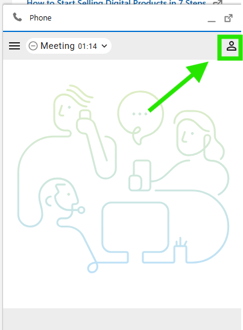
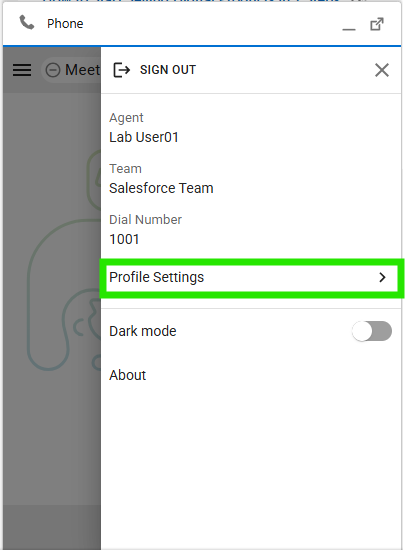
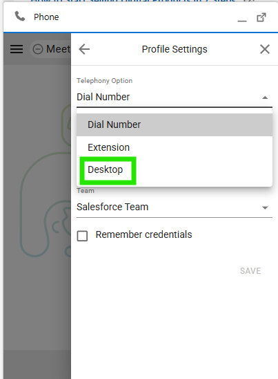
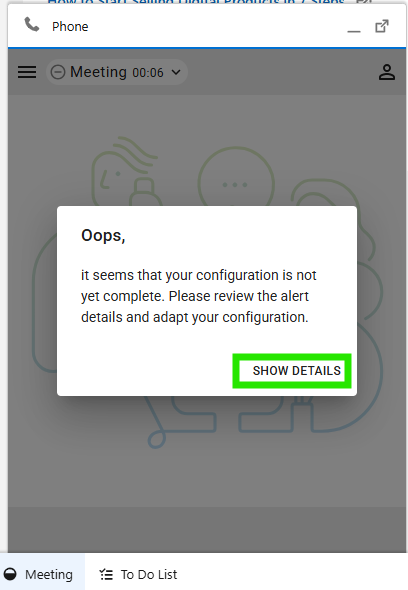
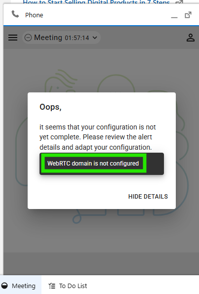
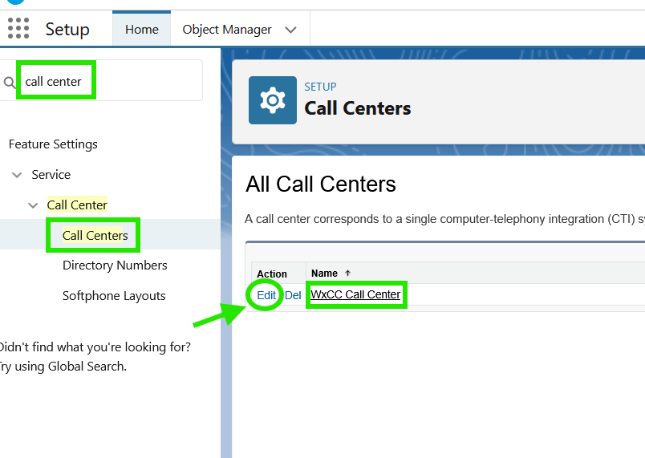
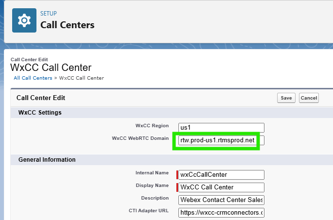
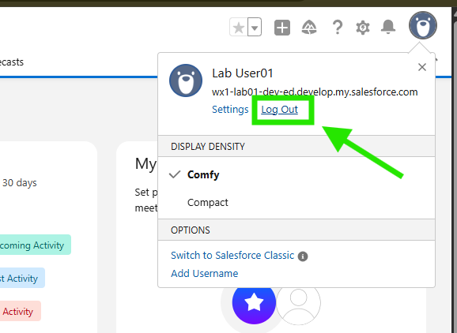
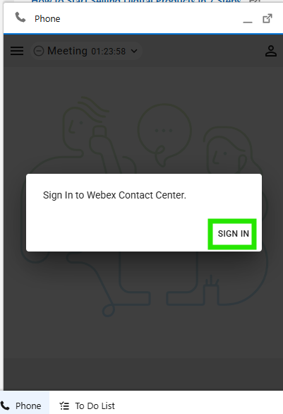
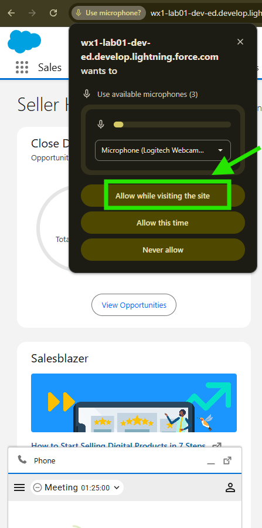

# Task 2 - Integrate Salesforce Connector with WebRTC

Please use the following credentials to complete the tasks:

| <!-- -->                  | <!-- -->         |
| ------------------------- | ---------------- |
| `Control Hub`             | <a href="https://admin.webex.com" target="_blank">https://admin.webex.com</a> |
| `Salesforce`   | <a href="https://login.salesforce.com" target="_blank">https://login.salesforce.com/</a> |
| `WxCC Username`       | labuser**ID**@wx1.wbx.ai     _(where **ID** is your selected pod number (01 through 10); i.e. labuser**02**@wx1.wbx.ai if selected pod is 2)_       |
| `WxCC Password`       | webexONE1!         |
| `Salesforce Username`       | As provided by the instructor       |
| `Salesforce Password`       | As provided by the instructor       |

!!! info "Task Objectives"
	- Login with WebRTC on Salesforce.
	- Troubleshoot and configure the steps needed to enable WebRTC login

 
## **Section 1 - Using WebRTC Option**

!!! warning "Attention"
	Please use the **Firefox** browser to access, configure, and test within the Salesforce portal.

- Navigate to Agent Desktop and select the Avatar on the top right

{ width="500" }

- Navigate to **'Profile Settings > Desktop > Save'** (or type _Call Centers_ in the search bar above the left-hand menu).

{ width="333" }
{ width="333" }
{ width="330" }

- Once the Save button is hit, the error message pops up "WebRTC domain is not configured" 

{ width="400" }
{ width="397" }

## **Section 2 - Steps to Correct and Enable WebRTC Login**

- In order to mitigate this issue, in Salesforce, navigate to **'Setup'** by clicking the gear icon in the top-right corner and selecting **'Setup'**.

{ width="800" }

- On the Salesforce portal, navigate to _**'Feature Settings > Service > Call Center > Call Centers'**_ (or type **_Call Centers_** in the search bar above the left-hand menu).

- Click 'Edit' on the the call center definition file **`WxCC Call Center`**
  
{ width="800" }

- Enter **'rtw.prod-us1.rtmsprod.net'** in the **'WxCC WebRTC Domain'**

{ width="800" }

!!! note
	The region defined here should match your Webex Contact Center region. Please refer to the [_Call Center configuration customizations_](https://help.webex.com/en-us/article/dyidod/Integrate-Webex-Contact-Center-with-Salesforce-(Version-2-New)#reference-template_2cf241c7-ade1-49d6-9582-b38467cb85f4) section for the list of the domains for other regions
    
- Click **'Save'**.
  
- Logout and log back in to salesforce.

{ width="800" }

## **Section 3 - Testing**

- Open the Webex Contact Center phone widget (bottom left) and login to Webex Contact Center Agent Desktop using the selected Webex Contact Center user credentials (e.g., _labuserID@wwx1.wbx.ai_):
- Enable the microphone option as show below. 

{ width="400" }
{ width="333" }

- Congratulations! You have complete the task.

