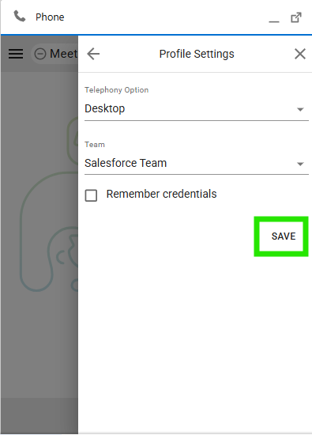
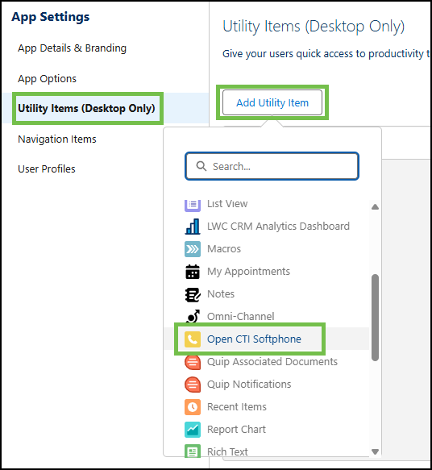
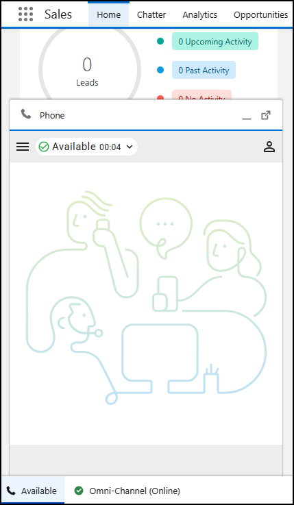

# Task 2 - Integrate Saleforce Connector with WebRTC

Please use the following credentials to complete the tasks:

| <!-- -->                  | <!-- -->         |
| ------------------------- | ---------------- |
| `Control Hub`             | <a href="https://admin.webex.com" target="_blank">https://admin.webex.com</a> |
| `Salesforce`   | <a href="https://login.salesforce.com" target="_blank">https://login.salesforce.com/</a> |
| `WxCC Username`       | labuser**ID**@wx1.wbx.ai     _(where **ID** is your selected pod number (01 through 10); i.e. labuser**02**@wxccciscolive2024.wbx.ai if selected pod is 2)_       |
| `WxCC Password`       | webexONE1!         |
| `Salesforce Username`       | As provided by the instructor       |
| `Salesforce Password`       | As provided by the instructor       |

!!! info "Task Objectives"
	- Login with WebRTC on Salesforce.
	- Troubleshoot and configure the steps needed to enable WebRTC login

 
## **Section 1 - Login with WebRTC Option**

!!! warning "Attention"
	Please use the **Firefox** browser to access, configure, and test within the Salesforce portal.

- Navigate to Agent Desktop and select the Avatar on the top right

{ width="800" }

- Navigate to **'Profile Settings > Desktop > Save'** (or type _Call Centers_ in the search bar above the left-hand menu).
- Click **'Import'**, choose the call center definition file (downloaded earlier) and click **'Import'** again.

{ width="400" }
{ width="400" }
{ width="400" }

- After the call center definition file is imported, edit it by clicking **'Edit'**.
- Change **'WxCC Region'** to **'us1'**.

!!! note
	The region defined here should match your Webex Contact Center region (i.e. ca1, anz1, eu1 etc.).

{ width="600" }

- Click **'Save'**.
- Add users to the Call Center:
	- Click **'Manage Call Center Users'** at the bottom of the page and then **'Add More Users'**.
	- Click **'Find'**, select the user in use (_User, User_), and click **'Add to Call Center'**.

{ width="500" }
{ width="800" }

## **Section 2 - Configure Softphone Layout**

- Navigate to **'Feature Settings > Service > Call Center > Softphone Layouts'** (or type _Softphone Layouts_ in the search bar above the left-hand menu).
- Click **'New'**.

{ width="800" }

- Provide a name for the **'Softphone Layout'** (e.g., _WxCC layout_).
- Select the **'Is Default Layout'** checkbox.
- Under **'Display these salesforce.com objects'**, add **'Case'**.

{ width="600" }

- Under **'Screen Pop Settings'**, expand **'No matching records'**, select **'Pop to new'**, and choose **'Contact'**.

{ width="800" }

!!! note
	Other Salesforce objects can be selected here as well. **'Contact'** is used as an example in this exercise. 

- Click **'Save'** at the top.

## **Section 3 - Configure CTI Softphone**

- Navigate to **'Apps > App Manager'** (or type _App Manager_ in the search bar above the left-hand menu).
- For the **'Sales'** app (line number 17; **'LightningSales'** developer) click **'Edit'** on the right-hand side.

{ width="800" }

- In the next window, select **'Utility Items (Desktop Only)'**.
- Click **'Add Utility item'** and choose **'Open CTI Softphone'**.

{ width="600" }

- Click **'Save'** and return to the previous page by clicking the back arrow icon at the top left corner.

## **Section 4 - Testing**

!!! warning "Attention"
	Please use the **Firefox** browser to access, configure, and test within the Salesforce portal.

- Click on the **'App Launcher'** icon (top left).
- Search for _Sales_ and click on the **'Sales'** option.

{ width="400" }

- Open the Webex Contact Center phone widget (bottom left) and login to Webex Contact Center Agent Desktop using the selected Webex Contact Center user credentials (e.g., _labuserID@wxccciscolive2024.wbx.ai_):
  	- For the phone number, select **'Extension'** and enter the extension in the format 10**NN** (where **'NN'** is your lab user number, e.g., _labuser**01**@wxccciscolive2024.wbx.ai_)':
	- For the team use **AITeamN** (where **'N'** is your lab user number, e.g., _labuser0**1**@wxccciscolive2024.wbx.ai_)'.

{ width="333" }
{ width="326" }
{ width="333" }

- Congratulations! You have complete the task.

