# Task 3 - Presence Synchronization Between Salesforce and Webex Contact Center

Please use the following credentials to complete the tasks:

| <!-- -->                  | <!-- -->         |
| ------------------------- | ---------------- |
| `Control Hub`             | <a href="https://admin.webex.com" target="_blank">https://admin.webex.com</a> |
| `Salesforce`   | <a href="https://login.salesforce.com" target="_blank">https://login.salesforce.com/</a> |
| `WxCC Username`       | labuser**ID**@wx1.wbx.ai     _(where **ID** is your selected pod number (01 through 10); i.e. labuser**02**@wxccciscolive2024.wbx.ai if selected pod is 2)_       |
| `WxCC Password`       | webexONE1!         |
| `Salesforce Username`       | As provided by the instructor       |
| `Salesforce Password`       | As provided by the instructor       |

!!! abstract "Info"
	Presence is crucial for agent productivity, especially when handling multiple contacts across different platforms. 
 	This task focuses on achieving presence synchronization between Webex Contact Center and Salesforce to ensure agents are utilized efficiently.

!!! info "Task Objectives"
	- Configure Salesforce presence statuses to match Webex Contact Center idle codes.
	- Enable presence statuses for the appropriate user profile.
	- Set up Omni-Channel state synchronization in Webex Contact Center settings.
	- Test state sync between Salesforce Omni-Channel and Webex Contact Center.

## **Section 1 - Create Presence Statuses**

!!! warning "Attention"
	Please use the **Firefox** browser to access, configure, and test within the Salesforce portal.

!!! note
	For presence synchronization to work between Salesforce and Webex Contact Center, the idle code names in Webex Contact Center must match the presence state names in Salesforce.

- In Salesforce, navigate to **'Setup'** by clicking the gear icon in the top-right corner and selecting **'Setup'**.

{ width="350" }

- Go to **'Feature Settings > Service > Omni-Channel > Presence Statuses'** (or type _Presence Statuses_ in the search bar in the left-hand menu).

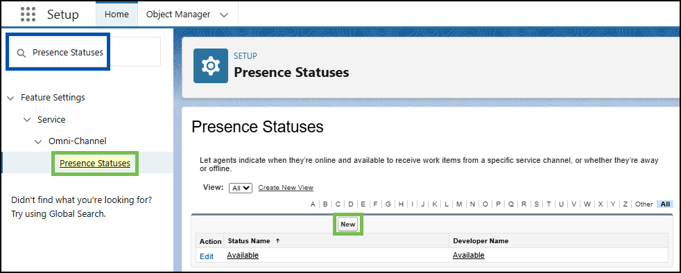{ width="800" }

- Create  two new **Presence Statuses**:
	- Click **'New'**.
	- Provide the name **wxccbusy** under **'Status Name'** and select **'Busy'** under **'Status Options'**.
	- Click **'Save'** and select **`Back to List: Service Presence Statuses'**
	- Create another **Presence Status** with the same options but use **sfbusy** under **'Status Name'**.

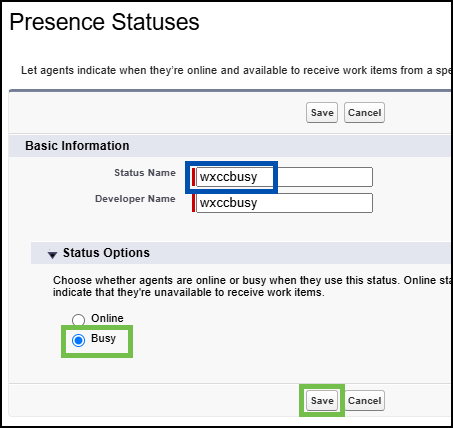{ width="500" }
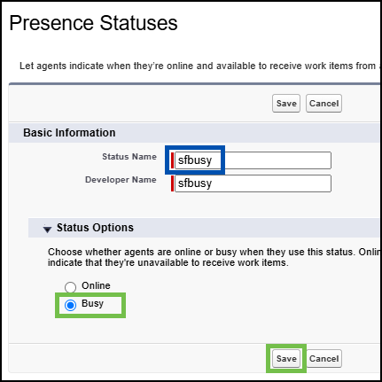{ width="500" }

## **Section 2 - Enable Presence Statuses for the User Profile** 

- Navigate to **'Users > Profiles'** (or type _Profiles_ in the search bar in the left-hand menu).
- Locate the **'System Administrator'** profile (select **`Next`** at the bottom to go to the next page) and click on it (do not click **'Edit'**).

!!! note
	For the purpose of this exercise, the **'System Administrator'** profile is used. Under normal circumstances, any other profile may be used by users.

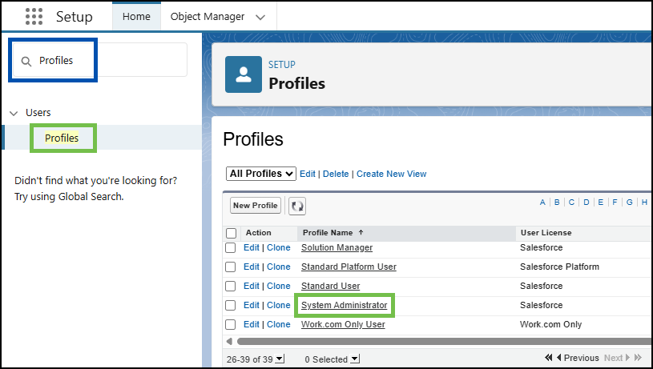{ width="800" }

- In the next window, hover over **'Enabled Service Presence Status Access'** and click **'Edit'**.

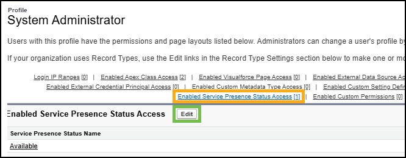{ width="800" }

- Move **sfbusy** and **wxccbusy** from **'Available Service Presence Statuses'** to **'Enabled Service Presence Statuses'**.

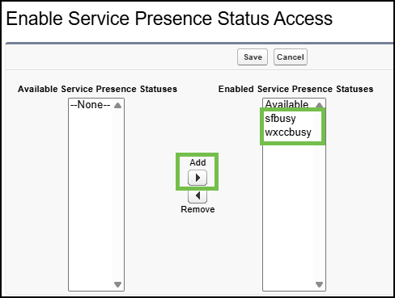{ width="600" }

- Click **'Save'**.

## **Section 3 - Configure Omni-Channel State Sync in Call Center Settings**

- Navigate to **'Feature Settings > Service > Call Center > Call Centers'** (or type _Call Centers_ in the search bar in the left-hand menu).
- Click **'Edit'** for **'WxCC Call Center'**.

{ width="800" }

- Under **'Omni-Channel State Sync Configuration'**, do the following:
	- Set **'Enable Omni-Channel Sync'** to **true** (type it in manually).
	- For **'Omni-Channel Not Ready Reason'**, type **wxccbusy**.
	- For **'WxCC Idle Reason Code'**, type **sfbusy**.

!!! note
	**'Omni-Channel Not Ready Reason'** is the name of the Salesforce Omni-Channel "Busy" reason status used when the agent receives an inbound call in Webex Contact Center.
 	**'WxCC Idle Reason Code'** is the name of the Webex Contact Center Idle code used when the agent receives an inbound chat in Salesforce.

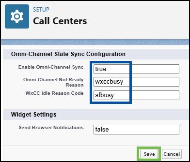{ width="500" }

- Click **'Save'**.

!!! note
	For the purpose of this lab, the idle code **sfbusy** has already been created on the Webex Contact Center side.

## **Section 4 - Testing Part 1**

!!! warning "Attention"
	Please use the **Firefox** browser to access, configure, and test within the Salesforce portal.

- Refresh Salesforce by logging out and logging back in (make sure to close any other Salesforce tabs).

{ width="500" }

- Click on the **'App Launcher'** icon (top left).
- Search for _Sales_ and click on the **'Sales'** option.

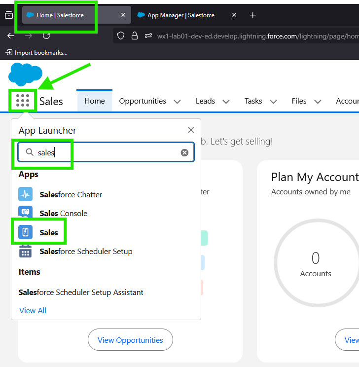{ width="400" }

!!! note "Reminder" 
	Please select the **'Extension'** option for the phone number. Use the extension number and team assignment based on your lab user number.

- Open the Webex Contact Center widget (**Phone**) and change the states (e.g., _sfbusy_, _available_) — the Salesforce **Omni-Channel** widget status should follow accordingly.
- Test changing the state from the Salesforce **Omni-Channel** widget — the Webex Contact Center widget should follow as well.

!!! note
	**'Omni-Channel Not Ready Reason'** is the name of the Salesforce Omni-Channel "Busy" reason status used when the agent receives an inbound call in Webex Contact Center. Therefore, the **wxccbusy** state on the Omni-Channel widget will only appear when an agent is actively engaged in a Webex Contact Center call (this will be tested in the next tasks)

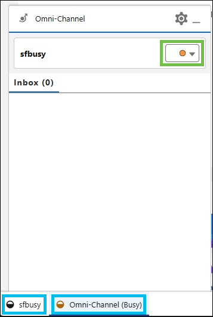{ width="333" }
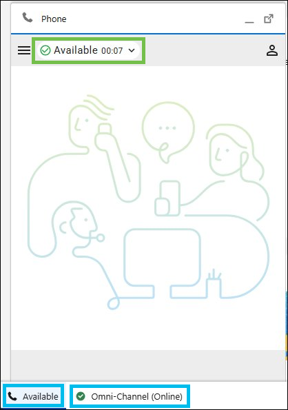{ width="347" }

- Congratulations! You have completed the task.

## Section 5 - Troubleshooting Failed Sync Due to Mismatched Idle Codes

- In Salesforce, navigate to **'Setup'** by clicking the gear icon in the top-right corner and selecting **'Setup'**.

{ width="350" }

- Go to **'Feature Settings > Service > Omni-Channel > Presence Statuses'** (or type _Presence Statuses_ in the search bar in the left-hand menu).

- Select **'Edit'** the Presence Status **sfbusy** created before 

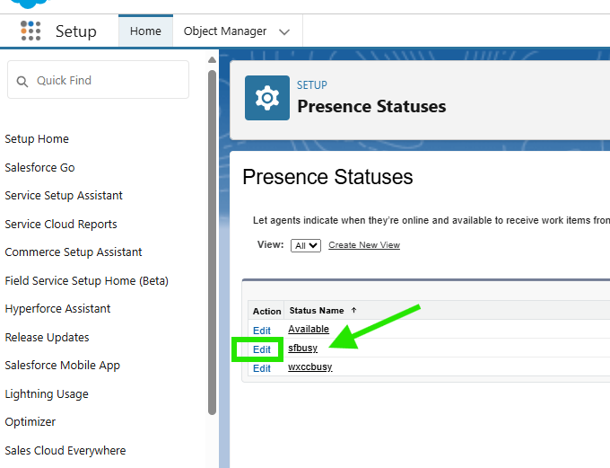{ width="600" }

- Update **sfbusy** to **Sfbusy** (capitalizing the letter S) and click **'Save'**.

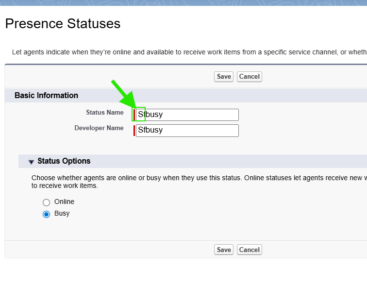{ width="500" }

- Refresh Salesforce by logging out and logging back in (make sure to close any other Salesforce tabs).

{ width="500" }

- Click on the **'App Launcher'** icon (top left).
- Search for _Sales_ and click on the **'Sales'** option.

{ width="400" }

- Open the Webex Contact Center widget (**Phone**) and change the states to **'Available'** — the Salesforce **Omni-Channel** widget status will be changed to **'Available'**

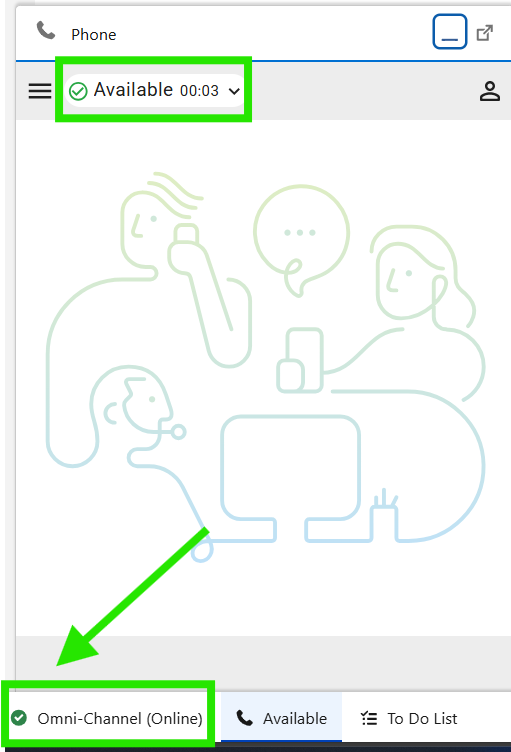{ width="400" }

- Test changing the state from the Salesforce **Omni-Channel** widget to **Sfbusy** and notice thatthe Webex Contact Center widget still shows as  **'Available'**

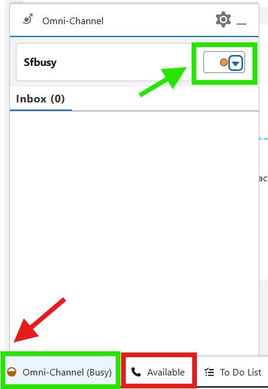{ width="400" }

!!! warning "Reason" 
	    When presence status on **sfbusy** is updated to **Sfbusy**, presence sync becasue idle code on WxCC is **sfbusy**. 
	    Omni-channel codes created on Salesforce and in Webex Contact Center needs to match in spelling and in case. 

- Congratulations! You have completed the task.

