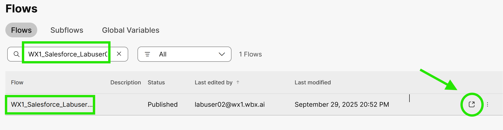
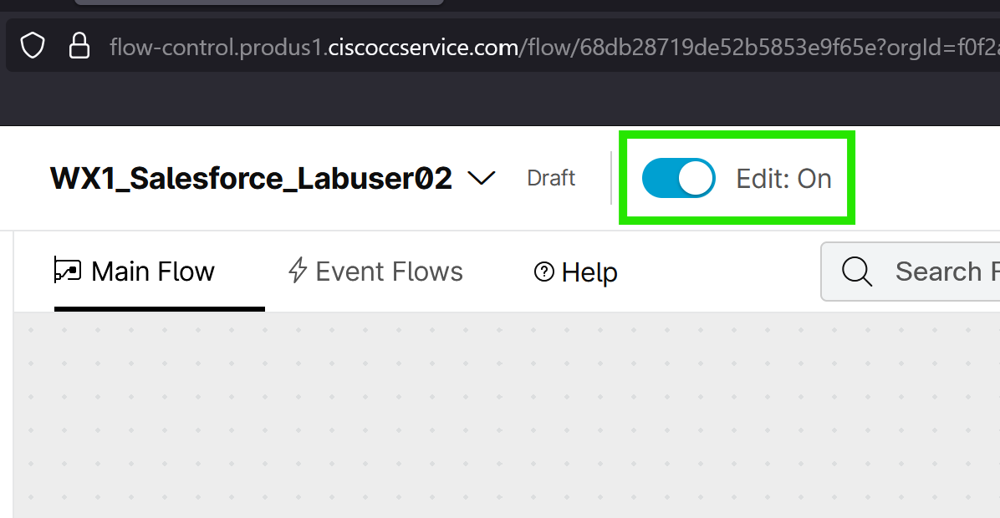
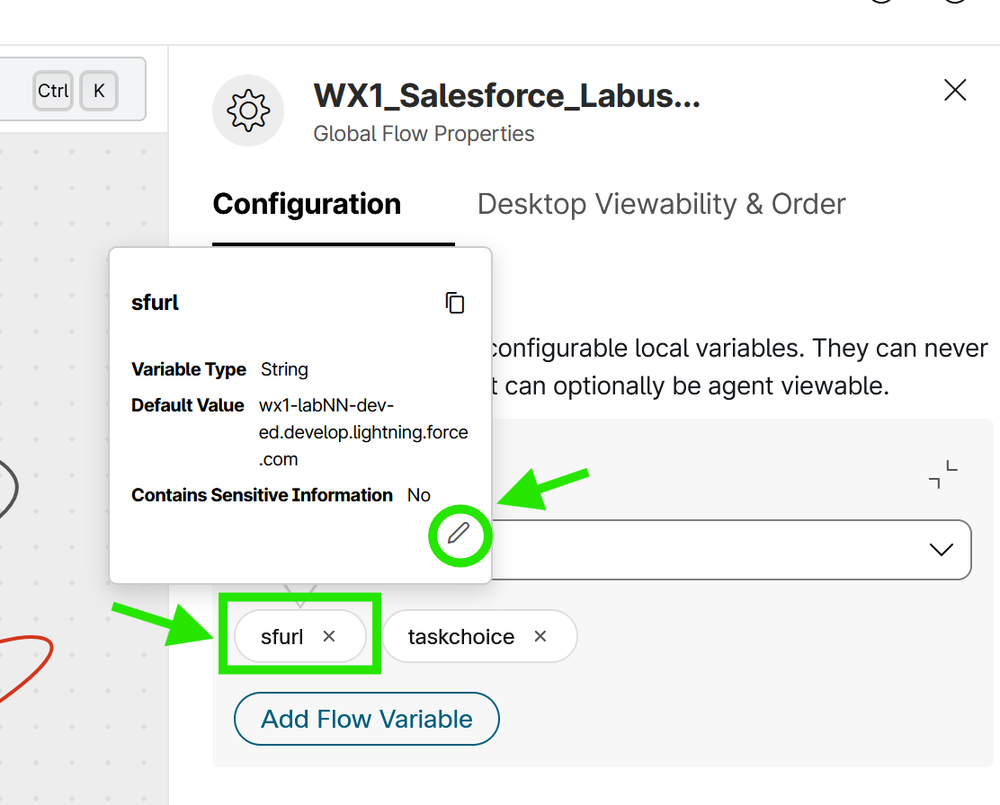
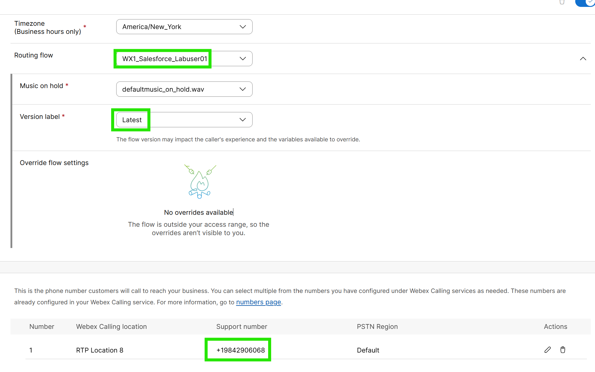
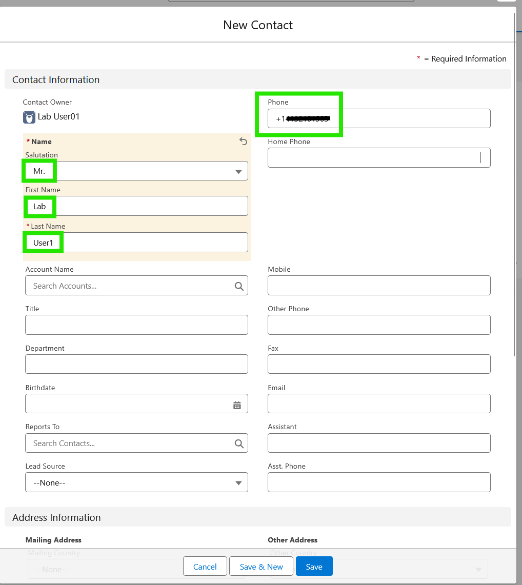

# Task 3 - Data Lookup Using CAD Variables


Please use the following credentials to complete the tasks:

| <!-- -->                  | <!-- -->         |
| ------------------------- | ---------------- |
| `Control Hub`             | <a href="https://admin.webex.com" target="_blank">https://admin.webex.com</a> |
| `Salesforce`   | <a href="https://test.salesforce.com" target="_blank">https://test.salesforce.com</a> |
| `WxCC Username`       | labuser**ID**@wxccciscolive2024.wbx.ai     _(where **ID** is your selected pod number (01 through 10); i.e. labuser**02**@wxccciscolive2024.wbx.ai if selected pod is 2)_       |
| `WxCC Password`       | ciscoLIVE1!         |
| `Salesforce Username`       | As provided in the Walk-In Lab (WIL) Assistant portal      |
| `Salesforce Password`       | As provided in the Walk-In Lab (WIL) Assistant portal       |


!!! abstract "Info"
	Utilizing CAD (Call-Associated Data) variables passed from Webex Contact Center enables agents to streamline their workflows and operate more efficiently when addressing customer interactions and requests. These variables provide agents with critical information, such as customer details or interaction context, directly within their interface. By having instant access to this data, agents can reduce the need for manual lookups, save time, and deliver a more personalized and effective customer experience. This not only improves agent productivity but also enhances overall customer satisfaction.

!!! info "Task Objectives"
	- Configure Call Center in Salesforce for advanced screen pop functionality.
	- Customize and publish a Webex Contact Center flow with Salesforce integration.
	- Test the integration by triggering a Salesforce contact creation via a phone call.

## **Section 1 - Salesforce Configuration**

!!! warning "Attention"
	Please use the **Firefox** browser to access, configure, and test within the Salesforce portal.

- Navigate to **'Setup'** by clicking the gear icon in the top-right corner and selecting **'Setup'**

{ width="350" }

- Go to **'Feature Settings > Service > Call Center > Call Centers'** (or type _Call Centers_ in the search bar in the left-hand menu).
- Click **'Edit'** for **'WxCC Call Center'**.

{ width="800" }

- Under **'Advanced Screen Pop Search Configuration'**, change **'Advanced Screen Pop Enabled'** to **true** (type it in manually).
- For **'CAD Variable Name'**, use _ani_.
- Under **'Screen Pop Settings for No Record Match'**, populate **'Object Field Mappings'** as follows:

``` ios
Phone={ani}
```

{ width="500" }


- Click **'Save'**.

## **Section 2 - Webex Contact Center Configuration**

- Log in to the <a href="https://admin.webex.com" target="_blank">https://admin.webex.com</a> using the credentials provided at the top of this page.
- After logging in, navigate to the **'Flows'** menu on the left-hand side.

{ width="200" }

- Copy the flow named **CLUS25_Salesforce_Template_DO_NOT_MODIFY** (the **'Copy'** option is on the right-hand side).

{ width="1000" }

- Open the copied flow by clicking the square 'Go to' button on the right hand side.

{ width="400" }

- Rename the flow to something more identifiable and personal (e.g., _labcol2010_andy_) by clicking the dropdown next to the flow name and selecting **'Edit Name'** (make sure **'Edit'** is set to **'On'**).

{ width="800" }

- Click on the **'QueueContact'** node and select **AIQueueN** (where **'N'** is your lab user number, e.g., _labuser0**7**@wxccciscolive2024.wbx.ai_).

{ width="1000" }

- Click on an empty space in the flow, then on the right-hand side, navigate to **'Custom Variables > Flow Variables'** section.
- Click on **sfurl** flow variable, select the **'Edit'** option (pencil icon), enter the fully qualified domain name (FQDN) from your Salesforce lab (e.g., _basslake-lagoon-6042-dev-ed.scratch.lightning.force.com_; without **_http://_**) as the Default Value, and click **'Save'**.

!!! warning "Attention" 
	The FQDN used for the **sfurl** variable must end with **.scratch.lightning.force.com**. While logged into the Salesforce portal, you can find the name of the Salesforce organization in the browser's address field.
	Note that the Salesforce Setup page will have a different domain ending (it does not end with **.scratch.lightning.force.com**). To obtain the correct FQDN, you can either navigate to the Salesforce Sales app and copy the full FQDN from the browser's address field there, or copy the Salesforce organization name from the Salesforce Setup page from the browser's address field and append it with **.scratch.lightning.force.com**.

{ width="500" }
{ width="500" }

- Turn Flow Validation **'On'** by clicking the **'Validation'** button at the bottom of the page to publish the flow. Once validation is complete, click **'Publish Flow'** and then **'Publish Flow'** again in the next dialog box (**Latest** version label is selected automatically).

{ width="300" }

- Navigate to the **'Channels'** menu in the Webex Contact Center configuration.

{ width="200" }

- Open **AIChannelN** (where **'N'** is your lab user number, e.g., _labuser0**7**@wxccciscolive2024.wbx.ai_), associate your newly created flow under 'Routing Flow' (note down the **'Support Number'** associated with this channel - it will be needed later in this lab for testing) and click **'Save'**.

{ width="1000" }


## **Section 3 - Testing**

!!! warning "Attention"
	Please use the **Firefox** browser to access, configure, and test within the Salesforce portal.

- Refresh Salesforce by logging out and logging back in (make sure to close any other Salesforce tabs).

{ width="400" }

- Click on the **'App Launcher'** icon (top left).
- Search for _Sales_ and click on the **'Sales'** option.

{ width="400" }

- Open the Webex Contact Center phone widget and login using the selected Webex Contact Center credentials.
- For the team use **AITeamN** (where **'N'** is your lab user number, e.g., _labuser**7**@wxccciscolive.wbx.ai_).

!!! note "Reminder" 
	Please select the **'Extension'** option for the phone number. Use the extension number and team assignment based on your lab user number.


- Make sure that the agent state is set to 'Available' and then call the channel number (noted from the steps above). In the IVR, choose **option 3**.
- Since Salesforce does not recognize your number, a new **Contact** create window will open with the phone number prefilled.
- Provide a name and save the contact in Salesforce.

{ width="1000" }

- End the call.
- Wrapup the session, make sure that the agent state is set to 'Available' and make another call. In the IVR, choose **option 3** again.
- This time, the system will open the matching contact, as it was created in the previous step.

{ width="400" }

- Congratulations! You have complete the task.
