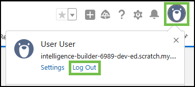

# Task 5 - Case Lookup Using Custom CAD Variables and Agent Desktop Screen Pop

	
Please use the following credentials to complete the tasks:

| <!-- -->                  | <!-- -->         |
| ------------------------- | ---------------- |
| `Control Hub`             | <a href="https://admin.webex.com" target="_blank">https://admin.webex.com</a> |
| `Salesforce`   | <a href="https://login.salesforce.com" target="_blank">https://login.salesforce.com/</a> |
| `WxCC Username` | labuser**ID**@wx1.wbx.ai <button onclick="copyText('labuserID@wx1.wbx.ai')">📋</button> |
|                       | _(where **ID** is your selected pod number (01 through 30); i.e. labuser**02**@wx1.wbx.ai if selected pod is 2)_       |
| `WxCC Password` | webexONE1! <button onclick="copyText('webexONE1!')">📋</button> |
| `Salesforce Username` | labuser**ID**@wx1.wbx.ai <button onclick="copyText('labuserID@wx1.wbx.ai')">📋</button> |
|                       | _(where **ID** is your selected pod number (01 through 30); i.e. labuser**02**@wx1.wbx.ai if selected pod is 2)_       |
| `WxCC Password` | webexONE1! <button onclick="copyText('webexONE1!')">📋</button> |

!!! abstract "Info"
	In addition to utilizing global variables collected during the customer's interaction in the Webex Contact Center IVR, this task demonstrates the functionality of the new Webex Contact Center CRM widget for Salesforce with screen pops that operate seamlessly without triggering multiple sign-in alert errors.

!!! info "Task Objectives"
	- Update Salesforce Call Center settings to enable advanced screen pop with the case variable.
	- Test case creation and retrieval in Salesforce via the Webex Contact Center phone widget.
 	- Have the case list open in a new tab during case retrieval.

## **Section 1 - Modifying Call Center Options in Salesforce**

!!! warning "Attention"
	Please use the **Firefox** browser to access, configure, and test within the Salesforce portal.

- Navigate to **'Setup'** by clicking the gear icon in the top-right corner and selecting **'Setup'**.

{ width="350" }

- Go to **'Feature Settings > Service > Call Center > Call Centers'** (or type _Call Centers_ in the search bar in the left-hand menu).
- Click **'Edit'** for **'WxCC Call Center'**.

{ width="800" }

- Under **'Advanced Screen Pop Search Configuration'**, set **'CAD Variable Name'** to **caseid** (type it in manually).

- Then click **'Save'**

{ width="500" }

## **Section 2 - Testing**

!!! warning "Attention"
	Please use the **Firefox** browser to access, configure, and test within the Salesforce portal.

- Refresh Salesforce by logging out and logging back in (make sure to close any other Salesforce tabs).

{ width="400" }

- Click on the **'App Launcher'** icon (top left).
- Search for _Sales_ and click on the **'Sales'** option.

{ width="400" }

- Open the Webex Contact Center phone widget and login using the selected Webex Contact Center credentials.
- For the team use **Salesforce_Team**. 

!!! note "Reminder" 
	Please select the **'Desktop'** option for the phone number. 

First call interaction:

- Make sure that the agent state is set to 'Available' and then call the channel number (as noted in the **Task 4**). In the IVR, choose **Option 4**.
- After answering the call selct **Create a new case** (highlitned in green) through the Webex Contact Center widget and note down the **case number** (highlitned in blue) - it's going to be needed for the second call below.

{ width="333" }
{ width="333" }

- End the call.
- Wrap up the session.
- Move to the **'Home'** tab in Salesforce Sales page.

{ width="400" }

Second call interaction:

- Make sure that agent state is set to 'Available' and then call the channel number again. In the IVR, choose **Option 5**.
- Provide the case number that was created during the previous call.
- The existing case should be displayed, and the case list should be displayed in a new tab.
- Select the **Phone** icon and the same call will now show in both the tabs

!!! warning
	If a new tab did not open with the case list, ensure that it was not blocked by the browser. A notification will appear in the browser indicating that a new tab popup was blocked. Click on the notification and select the tab link to open the new tab.
	
 	{ width="300" }

{ width="400" }
{ width="400" }

!!! note "The Why of This Exercise" 
	In the new salesforce connector we have solved the multi-sign in concerns when agent desktop is logged into 2 seperate tabs
	
- Congratulations! You have complete the task.
