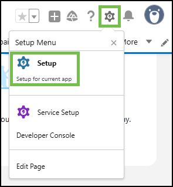

# Task 6 - Automatic New Case Creation Using Custom CAD Variables


Please use the following credentials to complete the tasks:

| <!-- -->                  | <!-- -->         |
| ------------------------- | ---------------- |
| `Control Hub`             | <a href="https://admin.webex.com" target="_blank">https://admin.webex.com</a> |
| `Salesforce`   | <a href="https://login.salesforce.com" target="_blank">https://login.salesforce.com/</a> |
| `WxCC Username`       | labuser**ID**@wx1.wbx.ai     _(where **ID** is your selected pod number (01 through 10); i.e. labuser**02**@wxccciscolive2024.wbx.ai if selected pod is 2)_       |
| `WxCC Password`       | webexONE1!         |
| `Salesforce Username`       | As provided by the instructor       |
| `Salesforce Password`       | As provided by the instructor       |


!!! abstract "Info"
	This task demonstrates the automatic case creation capability using the new Webex Contact Center (WXCC) Salesforce Connector, leveraging custom CAD variables from Webex Contact Center.

!!! info "Task Objectives"
	- Enable auto case creation via the Salesforce Call Center configuration file.
	- Set up CAD variable field mapping for auto case creation in the Salesforce Call Center settings.
 	- Test the auto case creation and CAD variable field mapping.

## **Section 1 - Modifying Call Center Options in Salesforce**

!!! warning "Attention"
	Please use the **Firefox** browser to access, configure, and test within the Salesforce portal.

- Navigate to **'Setup'** by clicking the gear icon in the top-right corner and selecting **'Setup'**.

{ width="350" }

- Go to **'Feature Settings > Service > Call Center > Call Centers'** (or type _Call Centers_ in the search bar in the left-hand menu).
- Click **'Edit'** for **'WxCC Call Center'**.

{ width="800" }

- Under **'Advanced Screen Pop Search Configuration'**, remove **'CAD Variable Name'** value (make it empty).
- Under **'Case Management'**, set **'Auto Case Creation For Inbound Calls'** to **true** (type it in manually) and **'Object Field Mappings'** as follows:
```cli
Subject={subject},Description={description}
```

{ width="500" }


## **Section 2 - Testing**

!!! warning "Attention"
	Please use the **Firefox** browser to access, configure, and test within the Salesforce portal.

- Refresh Salesforce by logging out and logging back in (make sure to close any other Salesforce tabs).

{ width="400" }

- Click on the **'App Launcher'** icon (top left).
- Search for _Sales_ and click on the **'Sales'** option.

{ width="400" }

- Open the Webex Contact Center phone widget and login using the selected Webex Contact Center credentials.
- For the team use **Salesforce Team**.

!!! note "Reminder" 
	Please select the **'Desktop'** option for the phone number. Use the extension number and team assignment based on your lab user number.


Making a test call:

- Make sure that agent state is set to 'Available' and then call the channel number (as noted in the **Task 4**). In the IVR, choose **Option 6**.
- A new case is automatically created, and the configured fields are prefilled with the call data.

{ width="1200" }

- End the call.
- Congratulations! You have complete the task and the lab!
